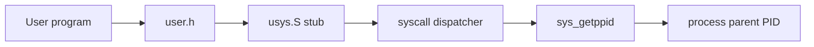
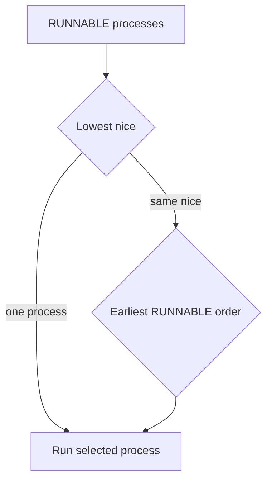
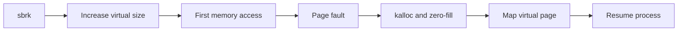
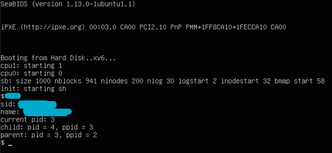
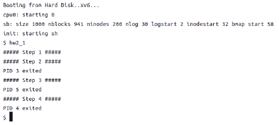

# xv6 Kernel Extensions

학부 운영체제 과제에서 구현한 시스템 콜, 우선순위 스케줄러, lazy page allocation을
보존 자료로부터 재구성한 기술 사례입니다. 2023년 구현과 2026년 포트폴리오 재검토를
구분하며, 확인되지 않은 당시의 기억이나 의도는 서술하지 않습니다.

## 15초 요약

| 해결 대상 | 구현한 방법 | 핵심 코드 | 현재 판정 |
|---|---|---|---|
| 부모 PID 조회 | xv6 시스템 콜 경로 확장 | `syscall.*`, `sysproc.c`, `usys.S` | 과제 요구 구현 |
| 프로세스 실행 순서 | nice 우선순위 + 동일 nice FCFS | `proc.c`, `proc.h`, `trap.c` | 과제 핵심 요구 구현 |
| 물리 메모리 할당 시점 | `sbrk`와 실제 할당 분리, page fault에서 매핑 | `sysproc.c`, `trap.c`, `vm.c` | 과제 핵심 요구 구현 |

> 2026년 재검토에서는 보존 코드와 과제 기준을 다시 대조해 타이머 기반 선점 경로를
> 바로잡았으며, 당시 구현과 이후 검토·수정 범위를 구분해 기록합니다.

## 자료 구성

- 과제 핵심 구현을 포함한 xv6 source
- 개인정보를 마스킹한 과제 1·2 당시 실행 기록
- 과제 제공 테스트와 분리해 작성한 독립 검증 코드 5개
- MIT 기반 코드와 개인 변경 범위를 구분한 출처·저작권 문서

## 코드 바로가기

| 기능 | 진입점 | 핵심 구현 | 검증 코드 |
|---|---|---|---|
| `getppid` | [`user.h`](user.h), [`usys.S`](usys.S) | [`syscall.c`](syscall.c), [`sysproc.c`](sysproc.c) | [`portfolio_getppid_test.c`](portfolio_getppid_test.c) |
| 우선순위 스케줄러 | [`proc.h`](proc.h) | [`scheduler`](proc.c#L336), [`setnice/getnice`](proc.c#L572) | [`portfolio_scheduler_policy_test.c`](portfolio_scheduler_policy_test.c) |
| 비선점 정책 | [`trap`](trap.c#L118) | timer interrupt 이후의 CPU 양보 조건 | [`portfolio_scheduler_nonpreemptive_test.c`](portfolio_scheduler_nonpreemptive_test.c) |
| Lazy allocation | [`sys_sbrk`](sysproc.c#L46) | [`T_PGFLT`](trap.c#L85), [`mappages`](vm.c#L61) | [`portfolio_lazyalloc_test.c`](portfolio_lazyalloc_test.c) |

## 구현 범위

### 1. `getppid` 시스템 콜

사용자 프로그램의 호출이 시스템 콜 스텁과 디스패치 테이블을 거쳐 커널의 프로세스
정보에 접근하는 흐름을 확장했습니다.



관련 파일:

- `user.h`, `usys.S`
- `syscall.h`, `syscall.c`
- `sysproc.c`
- `Makefile`

### 2. Nice 기반 우선순위 스케줄러

프로세스별 nice 값과 RUNNABLE 전환 순서를 기록하고 다음 정책으로 실행 대상을
선택하도록 스케줄러를 변경했습니다.

1. nice 값이 낮은 프로세스를 우선 선택합니다.
2. nice 값이 같으면 먼저 RUNNABLE 상태가 된 프로세스를 선택합니다.
3. 자식 프로세스는 부모의 nice 값을 상속합니다.
4. `yield`, `setnice`, `getnice`를 시스템 콜로 제공합니다.



2026년 재검토에서는 기존 `trap.c`가 타이머 인터럽트에서도 `yield()`를 호출하여
비선점 요구를 충족하지 못한다는 점을 확인했습니다. 타이머 경로의 자동 `yield()`는
제거하고, 명시적 `yield` 시스템 콜과 `setnice` 이후의 CPU 재선택 경로는 유지했습니다.

### 3. Lazy page allocation

`sbrk` 호출 시 가상 주소 범위만 먼저 확장하고, 실제 접근으로 페이지 폴트가 발생했을
때 물리 페이지를 할당하고 매핑합니다.



PDF의 핵심 요구인 지연 할당 경로는 구현되어 있습니다. 메모리 부족, 유효하지 않은 주소,
보호 위반, 매핑 실패 및 sparse address space 복사는 2026년 추가 보강 후보입니다.

## 문제와 해결 근거

| 기술적 문제 | 코드에서 확인되는 해결 | 근거 |
|---|---|---|
| 새 시스템 콜을 사용자 영역까지 노출 | 번호·dispatcher·handler·stub을 함께 연결 | `getppid` 자체 테스트 |
| 우선순위가 같은 프로세스의 실행 순서 | RUNNABLE 전환 순번을 기록하여 FCFS 선택 | scheduler policy 테스트 |
| heap 예약 시 불필요한 즉시 할당 | `sbrk`는 크기만 변경하고 fault 시 매핑 | lazy allocation 테스트 |
| 기존 스케줄러의 타이머 처리 불일치 | 타이머 기반 자동 `yield()` 제거, 명시적 양보 경로 유지 | 정적 경로 확인 및 독립 테스트 구성 |

## 검증 자료

### 당시 실행 기록

과제 1의 시스템 콜 실행 결과와 과제 2의 스케줄러 실행 결과입니다. 식별 정보가 표시된
영역만 마스킹했으며, 실행 출력은 수정하지 않았습니다.





### 2026년 독립 테스트 코드

과제에서 제공된 테스트는 저작권과 기여도 구분을 위해 포함하지 않았습니다. 저장소의
테스트는 포트폴리오 재검토 과정에서 실행 조건을 재현할 수 있도록 새로 작성했습니다.

| 프로그램 | 검증 대상 |
|---|---|
| `portfolio_getppid_test` | 자식 프로세스가 올바른 부모 PID를 조회하는지 |
| `portfolio_scheduler_api_test` | nice 범위, 조회, 변경, fork 상속 |
| `portfolio_scheduler_policy_test` | 우선순위 선택과 동일 nice FCFS |
| `portfolio_scheduler_nonpreemptive_test` | 타이머 인터럽트로 자동 선점되는지 |
| `portfolio_lazyalloc_test` | 지연 할당, zero-fill, fork, heap 축소 |

## 빌드 및 실행

이 저장소는 xv6-public x86 버전을 기반으로 합니다. 호환되는 GCC toolchain과 QEMU가
준비된 Linux 환경에서 다음 순서로 검증합니다.

```sh
make clean
make
make qemu-nox
```

xv6 shell에서 각 `portfolio_*_test` 프로그램을 개별 실행할 수 있습니다.

## 자료 출처와 공개 범위

- 기반 코드: MIT PDOS `xv6-public`
- 라이선스: 저장소의 `LICENSE` 참조
- 기준 커밋과 재구성 원칙: [`UPSTREAM.md`](UPSTREAM.md)
- 저작권 및 제외 자료: [`docs/COPYRIGHT.md`](docs/COPYRIGHT.md)
- 원본과 개선 구분: [`docs/ORIGINAL_REVIEW.md`](docs/ORIGINAL_REVIEW.md)
- 심사위원용 사례 요약: [`docs/CASE_STUDY.md`](docs/CASE_STUDY.md)

강의자료, 과제 명세, 교수 제공 테스트, 제출 ZIP과 식별 정보가 남아 있는 실행 화면은
포함하지 않습니다.
